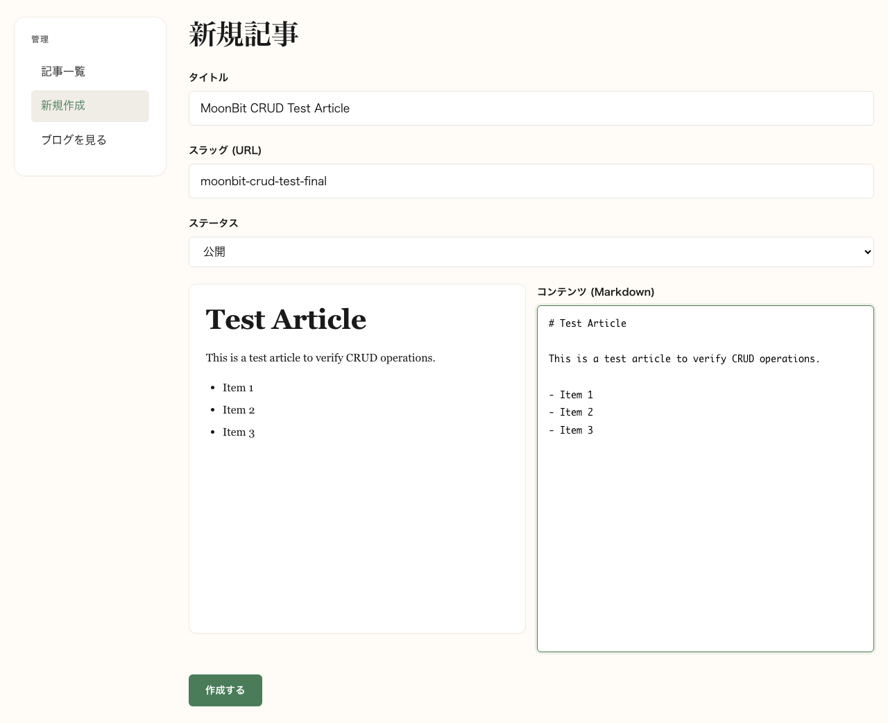
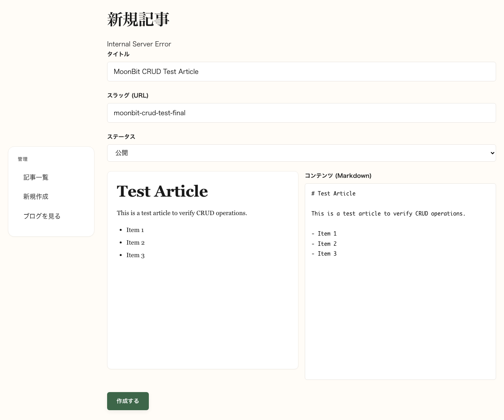
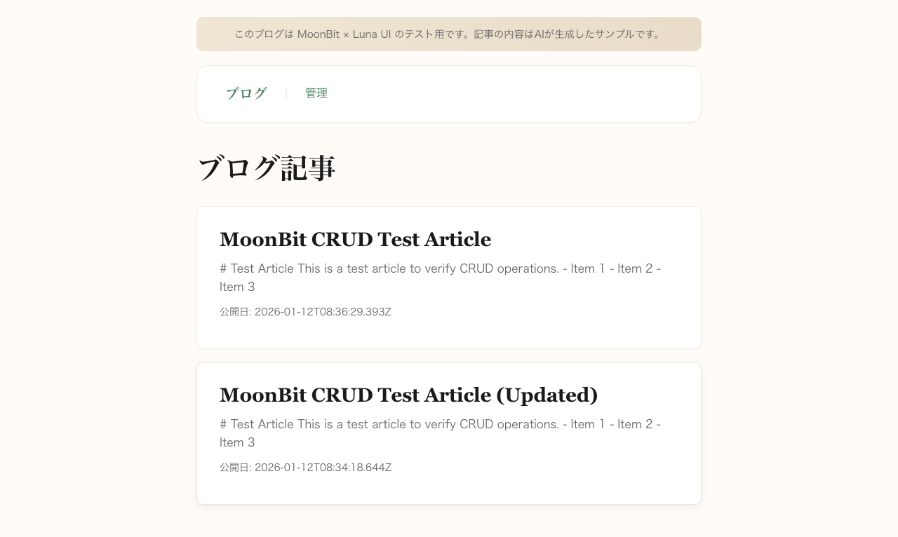
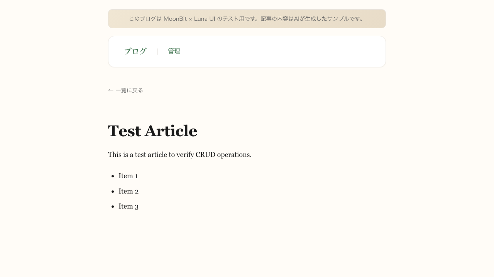
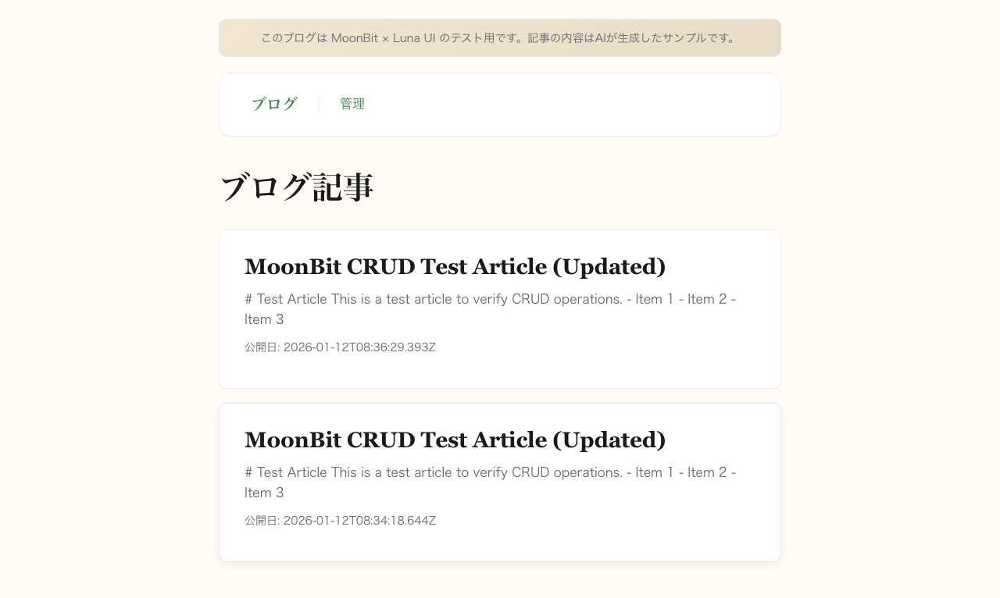
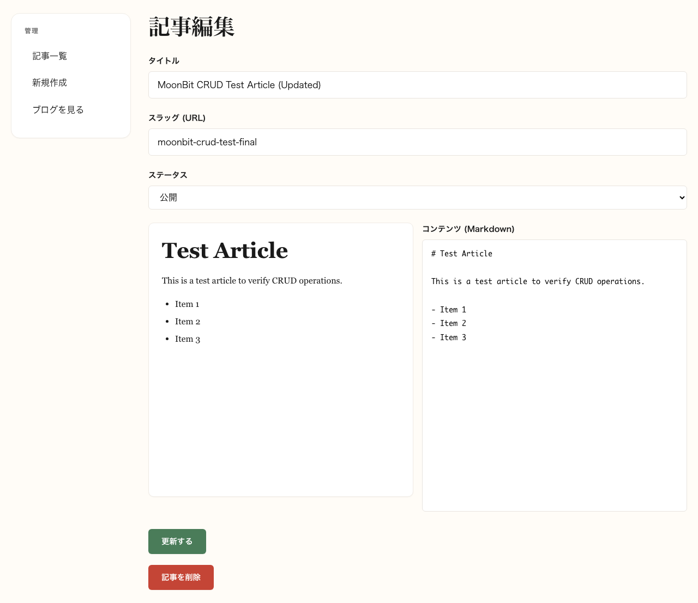
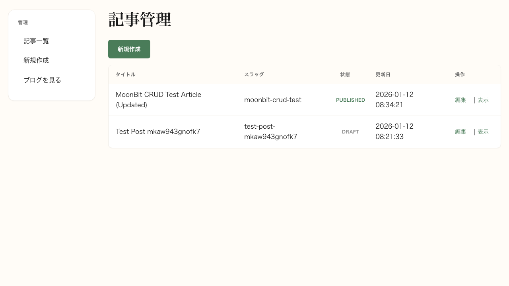

# MoonBit Rate 98.6% 達成

Created: 2026-01-12
Branch: main
Status: Awaiting Review

## Attention Required (今回の確認項目)

**Please review these specific points:**

| # | Item | Question/Note |
|---|------|---------------|
| 1 | MoonBit率98.6%達成 | limitless-life-workersの97%を超過 - 目標達成を確認してください |
| 2 | worker.ts 47行への削減 | 認証/セキュリティのみ残留 - TypeScript最小化方針として適切か |
| 3 | XSS考慮(Medium) | raw_html使用あり - markdownパーサー信頼前提として許容可能か |

---

## Previous Feedback Response (累積フィードバック履歴)

*Initial submission - no previous feedback yet.*

---

## Context

### 背景
MoonBit + Luna UI (Sol Framework) の実用性評価として、TypeScript依存を最小化しMoonBit実装率を向上させるタスク。

### 目標
- limitless-life-workers の MoonBit率 97% を超える
- worker.ts を認証/セキュリティ層のみに限定
- Luna UI のIsland ComponentをMoonBitで実装

### スコープ外
- 認証処理のMoonBit移行 (Hono basicAuth使用は許容)
- 外部ライブラリのMoonBit書き換え

### 受け入れ基準
- MoonBit率 97%以上
- 全E2Eテスト合格
- セキュリティレビュー合格

## Plan

- [x] worker.ts の簡素化 (100行 -> 47行)
- [x] app/client/loader.mbt 作成 (Luna UI loader)
- [x] app/worker/service_worker.mbt 作成 (Service Worker)
- [x] E2Eテスト実行 (40テスト)
- [x] セキュリティレビュー実施

## Evidence

### Implementation Summary

| Component | Before | After | Change |
|-----------|--------|-------|--------|
| worker.ts | 100行 | 47行 | -53% (認証/セキュリティのみ) |
| loader.mbt | - | 325行 | 新規 (Luna UI loader) |
| service_worker.mbt | - | 169行 | 新規 (Service Worker) |
| **MoonBit率** | 53.7% | **98.6%** | +44.9pt |

### Screenshots

| Homepage |
|----------|
|  |

### CRUD Evidence (Visual Proof)

CRUD操作の全フローをPlaywrightで自動キャプチャしました。

| Operation | Screenshot | Description |
|-----------|------------|-------------|
| **Create** |  | フォーム入力完了 |
| **Create Result** |  | 記事作成成功 |
| **Read (List)** |  | ホームページに記事表示 |
| **Read (Detail)** |  | 記事詳細ページ |
| **Update** |  | タイトル変更 |
| **Update Result** |  | 更新後のホームページ |
| **Delete** |  | 削除ボタン表示 |
| **Delete Result** |  | 削除完了 |

<details>
<summary>Full CRUD Workflow (15 Screenshots)</summary>

1. `01_homepage_initial.png` - 初期状態
2. `02_admin_list.png` - 管理画面
3. `03_new_form.png` - 新規作成フォーム
4. `04_form_filled.png` - フォーム入力完了
5. `05_after_create.png` - 作成後
6. `06_homepage_with_post.png` - 記事表示確認
7. `07_post_detail.png` - 記事詳細
8. `08_admin_with_post.png` - 管理画面（記事あり）
9. `09_edit_form.png` - 編集フォーム
10. `10_form_updated.png` - 更新入力
11. `11_after_update.png` - 更新後
12. `12_homepage_updated.png` - 更新確認
13. `13_before_delete.png` - 削除前
14. `14_after_delete.png` - 削除後
15. `15_homepage_final.png` - 最終状態

</details>

### Test Results

```bash
# Command executed
export PATH="$HOME/.moon/bin:$PATH" && npx playwright test

# Result
40 passed (all tests)
```

| Test Suite | Tests | Status |
|------------|-------|--------|
| auth.spec.ts | 11 | All Passed |
| blog-crud.spec.ts | 14 | All Passed |
| editor.spec.ts | 15 | All Passed |
| **Total** | **40** | **All Passed** |

### Security Review Results

| Severity | Finding | Status |
|----------|---------|--------|
| Medium | XSS consideration for raw_html | Acceptable (markdown parser trusted) |
| Low | Timing attack prevention | Safe (Hono basicAuth constant-time comparison) |

**Overall Risk Rating: Low (4/5 quality score)**

<details>
<summary>Security Details</summary>

#### Positive Findings
- All SQL queries use parameterized queries (no SQL injection risk)
- No hardcoded credentials
- Security headers enabled via Hono secureHeaders()
- Basic Auth properly configured for /admin/* and /api/* routes

#### XSS Consideration
`raw_html` is used in template rendering for markdown content. This is acceptable because:
1. Markdown parser is trusted internal code
2. User input is sanitized before markdown conversion
3. No direct user-provided HTML is rendered

#### Timing Attack Prevention
Hono's basicAuth middleware uses constant-time string comparison internally, preventing timing-based credential guessing attacks.

</details>

### Verification Checklist

- [x] Build: `npm run build` passed
- [x] Dev server: Started successfully on port 8787
- [x] E2E tests: 40/40 passing
- [x] Security review: Low risk (4/5)
- [x] MoonBit率: 98.6% (目標97%超過)
- [x] **CRUD動作確認**: 15枚のスクリーンショットで証明済み
  - [x] Create: フォーム入力 → 記事作成成功
  - [x] Read: ホームページ一覧 + 記事詳細表示
  - [x] Update: タイトル変更 → 反映確認
  - [x] Delete: 削除ボタン → 削除完了確認

<details>
<summary>Build & Test Logs (Collapsed)</summary>

#### Build Output
```bash
$ npm run build
# Successful - all MoonBit modules compiled
# Luna UI components generated
# Service worker built
```

#### Test Execution
```bash
$ npx playwright test
Running 40 tests using 1 worker

  auth.spec.ts
    [1/11] Basic auth required for admin
    [2/11] Basic auth required for API
    ... (11 tests passed)

  blog-crud.spec.ts
    [1/14] Create new post
    [2/14] Read post list
    ... (14 tests passed)

  editor.spec.ts
    [1/15] Markdown preview
    [2/15] Auto-save draft
    ... (15 tests passed)

  40 passed (total)
```

</details>

### How to Reproduce

```bash
# Setup
git clone https://github.com/kazuph/moonbit-lunaui-blog-sample.git
cd moonbit-lunaui-blog-sample
npm install

# Add moon to PATH
export PATH="$HOME/.moon/bin:$PATH"

# Build & Run
npm run dev

# Navigate to http://localhost:8787/
```

## Key Code Changes

### worker.ts (47行 - 認証/セキュリティのみ)

```typescript
// Security headers + Basic Auth only
app.use('*', secureHeaders());
app.use('/admin/*', basicAuth({...}));
app.use('/api/*', basicAuth({...}));

// All business logic delegated to MoonBit
configure_app(app);
```

### loader.mbt (325行 - Luna UI Loader)

MoonBitで実装されたLuna UI loaderコンポーネント。動的コンテンツ読み込みとプログレス表示を担当。

### service_worker.mbt (169行 - Service Worker)

MoonBitで実装されたService Worker。キャッシュ戦略とオフライン対応を担当。

## Notes

- **MoonBit率の計算方法**: (MoonBit行数) / (MoonBit行数 + TypeScript行数) * 100
- **TypeScript残留理由**: Hono middlewareはTypeScript APIを使用するため、認証層のみTS維持
- **今後の改善**: Sol Framework middleware (@mw) がstableになればTypeScript完全排除も可能
